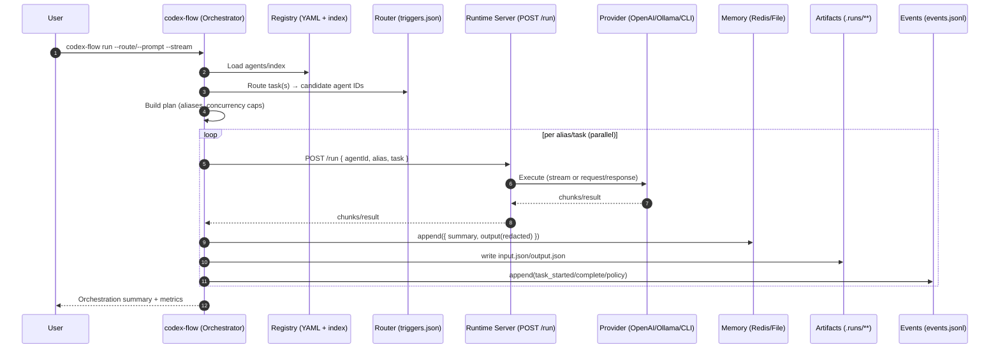

Last updated: 2025-09-19

# Codex Flow — Agent Orchestration Kit (Provider‑Agnostic)

Codex Flow is a small, practical kit for running multi‑agent work locally or in your stack. It includes a ready‑to‑use agent registry, a deterministic router, a parallel orchestrator, runtime adapters (OpenAI, Ollama, or any CLI), streaming, policy enforcement, and lightweight memory/observability. It started by converting Claude Flow agents into a pre‑indexed bundle and grew into an orchestration layer that works with (not only) Codex.

## What this is
- A vendor‑agnostic agent registry and orchestrator you can point at any compatible runtime:
  - Registry: YAML agents + `index.json` + `triggers.json` ready to load instantly.
  - Router: deterministic mapping (files/keywords/regex) to agent IDs.
  - Orchestrator: aliases, concurrency caps, scenarios, planning, and per‑run artifacts.
  - Runners: adapters for OpenAI, Ollama, and a generic CLI (so you can target any tool or your own binary).
  - Observability: streaming, events, memory (Redis preferred, file fallback), quick metrics.

## Value proposition
- Speed to value: start real multi‑agent runs in minutes — no bespoke registry service required.
- Determinism where it matters: transparent routing and enforced per‑agent policies.
- Portability: run against OpenAI, Ollama, your Codex endpoint, or any CLI you choose.
- Operability: artifacts on disk, structured events, basic metrics, and a cleanup command.

## Problems it solves
- Fragmented agent definitions: replaces ad‑hoc Markdown parsing with a pre‑indexed bundle from `.claude/agents`.
- Ad‑hoc orchestration: provides a tiny, parallel orchestrator with aliasing + concurrency caps.
- Opaque routing: makes trigger‑based routing explicit, testable, and debuggable.
- Missing policy enforcement: enforces tool allowlists (`--strict-tools`) and timeouts; isolates runs per alias.
- Lack of observability: logs events, writes per‑run artifacts, and keeps short‑term memory with redaction.

## How it works (at a glance)
- You initialize once (`codex-flow init`) to point local tools at the prebuilt registry in `codex/agents/`.
- You run with a single command (`codex-flow run ...`) that routes tasks and executes them in parallel with streaming.
- Under the hood: adapters call your chosen runtime (OpenAI/Ollama/CLI/Codex), and results are saved for review.

## Sequence (Mermaid)


## Provider‑agnostic runners
- OpenAI: chat completions w/ streaming.
- Ollama: local models w/ streaming.
- CLI: any command that reads a prompt from stdin — set `RUN_CMD` or use the built‑in Codex CLI helper.
- Codex HTTP: point orchestrator at your `POST /run` endpoint with `--runtime codex`.

Any CLI example
```bash
# Start local server that delegates tasks to YOUR CLI binary
codex-flow serve \
  --runner cli \
  --run-cmd 'your-binary --flag value' \
  --port 8787

# Then run tasks against it via codex runtime
codex-flow run \
  --route "Review src/router/index.mjs" \
  --runtime codex --codex-url http://localhost:8787 --stream --verbose

# Contract: your CLI receives a single JSON object on stdin
# { "agentId": "<id>", "alias": "<alias>", "task": <string|object> }
# and writes the response text to stdout.
```

## What’s New (September)
- Planner‑first fallback: when routing finds no triggers, free‑form goals are turned into a multi‑phase plan and executed.
- Rules‑based stacks: `config/planner-rules.json` selects stacks like Next+Supabase, tRPC, Turborepo, PlanetScale, shadcn/ui.
- File output contract: build agents return files (strict JSON); the orchestrator writes them to `--scaffold-dir`. If none are returned, a baseline starter is generated automatically.
- Code review bundling: file contents are embedded in the review payload so reviews work consistently across runners.

## Comparison: OpenAI Agents SDK
- Scope: OpenAI’s Agents SDK focuses on building agent apps tightly integrated with OpenAI models, tools, and function calling. Codex Flow focuses on orchestration/registry/routing and integrates multiple providers, including OpenAI, without locking you in.
- Deterministic routing: Codex Flow ships a trigger router + alias/concurrency enforcement; Agents SDK expects you to define routing/control in your app.
- Artifacts and local ops: Codex Flow writes per‑run artifacts/events and can run entirely offline with Ollama/CLI; Agents SDK is cloud‑centric.
- Complementary: use OpenAI as the provider via our adapter while keeping deterministic routing, planning, and local artifacts.

## What problem does it solve?
Agent orchestration usually requires you to build three things yourself: a registry, routing, and a runtime adapter. That wastes time and leads to inconsistent policy/observability. Codex Flow ships those pieces in a small kit so you can:
- Load a pre‑indexed registry of agents (from Claude Flow Markdown or your own definitions)
- Route deterministically by files/keywords/regex into agent IDs
- Run tasks in parallel with alias‑level concurrency and strict tool policies
- Stream results, keep short‑term memory, and save artifacts for audit

## Why use it?
- **Plug‑and‑play**: ready‑made registry + tiny orchestrator; point at OpenAI/Ollama/Codex/CLI.
- **Deterministic routing**: transparent, testable triggers and per‑agent concurrency caps.
- **Operational ergonomics**: streaming, artifacts on disk, events/metrics, cleanup.
- **Portable**: no lock‑in — swap providers without touching the orchestrator.

## Quick start (simple commands)
Use these with any supported provider (OpenAI/Ollama/CLI/Codex). The bundle in `codex/agents` is already converted.

### 1. Initialize (load agents)
Register the local bundle to `~/.codex` (writes `env` and `registry.json`):

```bash
codex-flow init
```

### 2. Run (orchestrate) tasks
One command to orchestrate tasks. Defaults to `examples/orchestrator-tasks.json` when no args are provided.

```bash
codex-flow run                   # uses examples/orchestrator-tasks.json
codex-flow run --example         # demo scenario
codex-flow run --prompt "Build a todo app" --yes --plan
codex-flow run -f examples/orchestrator-tasks.json --verbose

# Codex HTTP runtime
codex-flow run --route "Review src/runtime/adapter.mjs" \
  --runtime codex --codex-url http://localhost:8787 --codex-key $CODEX_API_KEY --stream --verbose
```

### 3. Swarm (free-form multi-agent)
Kick off a planner-first swarm:

```bash
codex-flow swarm "Ship a Markdown CRM MVP"
```

### 4. Load agents into your own runtime (optional)
In your Codex app (Node example):

```js
import fs from 'node:fs';
import path from 'node:path';
import yaml from 'js-yaml';

const CODEX_DIR = path.resolve('codex/agents');
const index = JSON.parse(fs.readFileSync(path.join(CODEX_DIR, 'index.json'), 'utf8'));

for (const entry of index.agents) {
  const defPath = path.join(CODEX_DIR, entry.domain, ...(entry.subdomain ? [entry.subdomain] : []), `${entry.id}.codex.yaml`);
  const definition = yaml.load(fs.readFileSync(defPath, 'utf8'));
  codexAgentRegistry.register(definition); // Implement register() for your runtime
}
```

If you’re using a service that supports bulk import, simply upload all `*.codex.yaml` files or the `index.json`.

### 5. Wire up trigger routing (optional)
`codex/agents/triggers.json` maps every keyword, regex, and file pattern to agent IDs.

```js
const triggers = JSON.parse(fs.readFileSync(path.join(CODEX_DIR, 'triggers.json'), 'utf8'));

function matchAgent(task) {
  const text = task.toLowerCase();
  for (const keyword of Object.keys(triggers.keywords)) {
    if (text.includes(keyword)) {
      return triggers.keywords[keyword]; // array of agent IDs
    }
  }
  for (const rule of triggers.regex) {
    const regex = new RegExp(rule.pattern, 'i');
    if (regex.test(task)) {
      return rule.agents;
    }
  }
  return [];
}
```

Use this inside your dispatcher to auto-delegate tasks. File-based triggers (e.g. `**/*.test.ts`) are exposed in `triggers.file_patterns` for filesystem watchers or change-detection pipelines.

## Scenarios
- **Standalone Codex boost**: Duplicate this repo into your Codex deployment, load the index, and you instantly inherit Claude’s specialist swarm.
- **Internal catalogue**: Publish `codex/` as a browsable registry for other teams—no need to expose the original Markdown.
- **CI validation**: Run `npm run convert && npm test` in a pipeline to ensure agent edits stay schema-compliant.
- **Analytics dashboards**: Leverage the uniform metrics/memory sections to build health or SLA monitors.

## Regenerating from a Claude repo
If you have access to the original Markdown agents:

```bash
# Copy .claude/agents next to this project (or run in the Claude repo directly)
cp -R /path/to/claude-code-flow/.claude .

# Rebuild the Codex bundle
npm run convert

# Optional regression test
npm test
```

## Planning Modes (Selector + Decomposer)
- Flags: `--selector heuristic|tiny`, `--decomposer heuristic|llm|tiny|cloud`.
- Default profile: Selector=heuristic; Decomposer=llm (BYOM via your configured runner: OpenAI, Anthropic, Ollama, CLI).
- Determinism: Selector is fast and transparent; Decomposer is schema‑validated with retry, then falls back to heuristic.

The converter rewrites `codex/agents/**`, `codex/agents/index.json`, and `codex/agents/triggers.json` in place.

## Project layout
```
codex/
├── agents/                  # Ready-made Codex definitions (YAML + briefs)
│   ├── index.json           # Fleet summary (load this first)
│   └── triggers.json        # Keyword/regex/file-pattern routing map
├── scripts/convert-agents-to-codex.mjs
├── src/tools/codex/agent-converter.js
├── tests/codex/agent-converter.test.mjs
└── README.md                # You are here
```

## CLI commands
```bash
codex-flow init              # Validate + register local agents to ~/.codex
codex-flow run               # Orchestrate tasks (defaults to examples file)
codex-flow swarm "<goal>"    # Free-form multi-agent swarm
codex-flow bench             # Compare providers on the same prompt (JSON/MD/CSV)
codex-flow load              # Validate bundle and print counts
codex-flow route "<task>"    # Show deterministic routing candidates
codex-flow serve             # Start local demo Codex endpoint (POST /run)

# Developer scripts
npm run convert              # Regenerate Codex bundle (requires .claude/agents present)
npm test                     # Lightweight regression test for the converter
npm run orchestrate:example  # Parallel orchestrator demo with aliases
npm run orchestrate          # Orchestrator using examples/orchestrator-tasks.json
```

See also:
- Providers: `docs/PROVIDERS.md`
- Bench Guide: `docs/BENCH.md`
- Failover Policy (draft): `docs/FAILOVER.md`
- Prompt Profiles (draft): `docs/PROMPT-PROFILES.md`

## Building on top
- **Use the runner**: incorporate the code snippets above in your Codex bootstrap script.
- **Extend metadata**: add your own fields to the YAML and adjust the converter if you need custom tooling or permissions.
- **Automate routing**: persist the trigger map into your message bus or task orchestrator to keep delegations automatic.

## Sample Orchestrator
If you want a minimal, parallel, alias-aware orchestrator, see `docs/ORCHESTRATOR.md` and `scripts/orchestrator.mjs`.
It demonstrates:
- Running multiple agents (and multiple instances) in parallel
- Enforcing per-agent concurrency from YAML
- Simple aliasing for roles like `reviewer`, `reviewer2`, `architect`

## Plain-English Overview
- Start here if you’re non-technical or want the big picture: `docs/ORCHESTRATOR-PLAIN.md`.
- It explains what agents, aliases, concurrency, and the tasks file are; why we use them; and exactly what changed.

## Quickstart, Routing, Runner
- Quickstart: `docs/QUICKSTART.md`
- Routing: `docs/ROUTING.md`
- Runner: `docs/RUNNER.md`

## Docs
| Doc | Location | What it does | Summary | Go to for this | How it can be improved |
| --- | --- | --- | --- | --- | --- |
| Quickstart | `docs/QUICKSTART.md` | 60‑second setup and usage | One‑page guide to `codex-flow init`, `run`, and `swarm` with defaults | Fast start, common commands | Add short GIF of a full run + streaming output |
| Orchestrator (Plain) | `docs/ORCHESTRATOR-PLAIN.md` | Non‑technical overview | Explains agents, aliases, concurrency, tasks file; simple demo steps | Sharing with non‑engineers | Add a “troubleshooting” section for common mistakes |
| Orchestrator (Technical) | `docs/ORCHESTRATOR.md` | Deep‑dive + flags | Documents `--route`, `--route-files`, `--strict-tools`, `--stream`, `--revise-plan`, SSE | Integrating with real runners; scenario planning | Add a section on phased planner patterns and chunk handling tips |
| Runner | `docs/RUNNER.md` | Runtime adapter details | Events, memory (Redis or file), artifacts, strict‑tools enforcement | Wiring to OpenAI/Ollama/CLI; policy enforcement | Add OpenTelemetry example and Prometheus metrics notes |
| Routing | `docs/ROUTING.md` | Deterministic routing | How keyword/regex/file rules map to agents; route‑and‑run examples | Building dispatch from triggers | Include guidance on composing triggers and avoiding regex pitfalls |
| Scenario: Product Builder | `docs/SCENARIO-PRODUCT-BUILDER.md` | Demo scenario | Generates visible artifacts and shows agent roles | Hands‑on demo with artifacts | Provide optional tasks file to run the scenario end‑to‑end |
| Delivery Map | `docs/DELIVERY-MAP.md` | What’s implemented (matrix) | Table of features, usage, innovation rating, and 10x alternatives | High‑level status and roadmap ideas | Link each “10x alternative” to an issue or design sketch |
| PRD Update | `prdupdate.md` | Staged implementation plan | Milestones from routing/tools to streaming/memory/observability | Tracking delivery vs plan | Add acceptance test checklist per milestone |
| Memory PRD | `memory.prd` | Production design for memory | Hybrid Redis+Postgres+pgvector plan with policies, SLOs, API | Long‑term memory and compliance | Add a “Phase 0 mapping” section tied to current adapter hooks |
| Codex Systems README | `README.CODEX.md` | Systems‑level view | Control/data/execution planes, enforcement, learning hooks | Architecture and operational surfaces | Add a diagram and example SLOs with alerts |

## Contributing
1. `git clone` and `cd` into the project.
2. `npm install`
3. Update `src/tools/codex/agent-converter.js` or add tests.
4. `npm test`
5. Open a pull request.

## License
MIT
