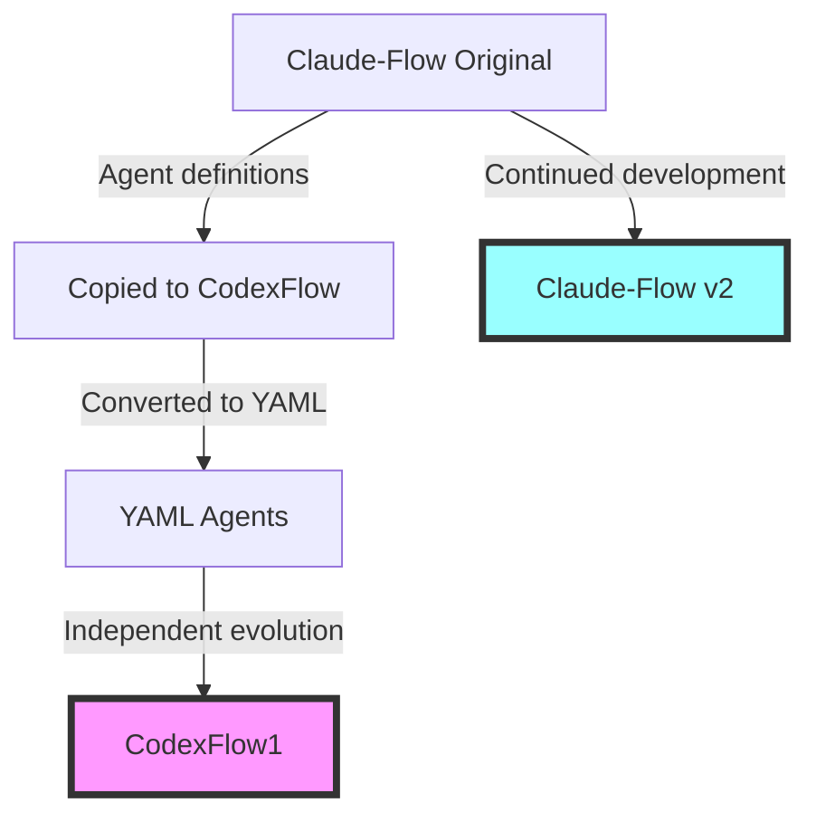

# 🔬 Deep Technical Analysis: CodexFlow1 vs Claude-Flow
## Independent Platforms Comparison Report

---

## Executive Summary

After thorough analysis, **CodexFlow1** and **Claude-Flow** are revealed to be **completely independent systems** with different philosophies and architectures. CodexFlow1 initially borrowed agent definitions from Claude-Flow but converted them to YAML and evolved independently.

**Key Finding**: CodexFlow1 represents a **fundamentally different approach** to agent orchestration - focusing on lightweight, file-based configuration with flexible runtime adapters, while Claude-Flow provides a full TypeScript-based MCP server implementation.

---

## 📊 Core Architecture Comparison

### Table 1: Fundamental Differences

| Aspect | CodexFlow1 | Claude-Flow | Analysis |
|--------|------------|-------------|----------|
| **Origin** | Independent development (borrowed initial agents) | Original TypeScript implementation | Different codebases |
| **Architecture** | CLI tool with runtime adapters | MCP server + orchestrator | Different paradigms |
| **Language** | JavaScript ES Modules | TypeScript | Both modern JS |
| **Agent Format** | YAML files | TypeScript modules | File vs code |
| **Execution** | Multiple runtimes (stub, CLI, cloud) | Native TypeScript | CodexFlow more flexible |
| **Dependencies** | Minimal (js-yaml) | Extensive TypeScript stack | CodexFlow lighter |
| **Installation** | Standalone CLI | NPM + MCP server | Different deployment |
| **Philosophy** | Configuration-driven | Code-driven | Opposite approaches |

### Table 2: Agent System Architecture

| Feature | CodexFlow1 | Claude-Flow | Key Difference |
|---------|------------|-------------|----------------|
| **Agent Storage** | `codex/agents/*.yaml` | TypeScript modules | Static files vs dynamic code |
| **Agent Registry** | JSON index + bootstrap | Runtime registration | Build-time vs runtime |
| **Agent Discovery** | Directory scanning | Import statements | File system vs module system |
| **Agent Definition** | YAML with patterns/tools | TypeScript interfaces | Declarative vs programmatic |
| **Custom Agents** | Add YAML file | Modify TypeScript | Much simpler in CodexFlow |
| **Agent Count** | ~50 agents | 65+ agents | Claude-Flow has more |
| **Agent Categories** | Same categories (inherited) | Original categories | CodexFlow borrowed structure |

### Table 3: Execution Models

| Component | CodexFlow1 | Claude-Flow | Innovation |
|-----------|------------|-------------|------------|
| **Planning** | Dual-mode (Selector + Decomposer) | Single orchestrator | **CodexFlow unique** ✨ |
| **Routing** | Pattern-based (regex, keywords, files) | Task matching | **CodexFlow advanced** ✨ |
| **Runtime** | Pluggable adapters | Fixed TypeScript | **CodexFlow flexible** ✨ |
| **Execution** | CLI spawn or API calls | Direct execution | Different models |
| **Parallelism** | Explicit in orchestrator | Built into swarm | Both support |
| **Memory** | File-based + SQLite | SQLite + distributed | Similar approach |

---

## 🎯 Innovation Points

### CodexFlow1's Unique Innovations

1. **Dual-Mode Planning System** 🌟
   - **Selector**: Agent capability matching
   - **Decomposer**: Task breakdown logic
   - Separation allows independent optimization
   - Multiple planning strategies (heuristic, FSM, LLM)

2. **Advanced Routing System** 🌟
   ```yaml
   routing:
     - pattern: "*.test.js"
       agent: tester
     - keyword: "database"
       agent: backend-dev
     - regex: "^feat\\(.*\\):"
       agent: api-docs
   ```

3. **Runtime Adapter Pattern** 🌟
   - Stub runtime for testing
   - CLI runtime for execution
   - Cloud runtime for scaling
   - Pluggable architecture

4. **YAML-Based Agent System** 🌟
   - Zero-code agent definition
   - Easy customization
   - Version control friendly
   - No compilation needed

### Claude-Flow's Strengths

1. **Native MCP Server** ✓
   - Direct MCP protocol support
   - Real-time communication
   - Built-in tool definitions

2. **TypeScript Type Safety** ✓
   - Compile-time checking
   - Better IDE support
   - Stronger contracts

3. **Integrated Swarm Orchestration** ✓
   - Built-in coordination
   - Native parallelism
   - Advanced topologies

---

## 📈 Performance & Scalability

| Metric | CodexFlow1 | Claude-Flow | Notes |
|--------|------------|-------------|-------|
| **Startup Time** | Faster (minimal deps) | Slower (TypeScript) | CodexFlow lighter |
| **Memory Usage** | Lower | Higher | Due to runtime differences |
| **Agent Definition** | Instant (YAML) | Requires compilation | CodexFlow faster iteration |
| **Customization** | File editing | Code changes | CodexFlow simpler |
| **Type Safety** | None | Full TypeScript | Claude-Flow safer |
| **Scalability** | Via runtime adapters | Via MCP clustering | Different approaches |

---

## 🔄 Relationship History



**Timeline:**
1. Claude-Flow creates original agent definitions
2. CodexFlow1 project starts, copies agent concepts
3. CodexFlow1 converts agents to YAML format
4. Both projects evolve independently
5. No runtime dependency between them

---

## 💡 Use Case Recommendations

### Choose CodexFlow1 When:
✅ You prefer configuration over code
✅ Need simple agent customization
✅ Want minimal dependencies
✅ Require flexible runtime options
✅ Like file-based workflows
✅ Need advanced routing patterns
✅ Want quick iteration without compilation

### Choose Claude-Flow When:
✅ You need MCP server capabilities
✅ Want TypeScript type safety
✅ Require integrated swarm orchestration
✅ Need real-time coordination
✅ Want programmatic agent definition
✅ Prefer code-based configuration
✅ Need extensive built-in tools

### Can They Work Together?

**No direct integration** - they are independent systems. However, you could:
- Use both for different parts of your workflow
- Port agent definitions between them (with conversion)
- Learn from both approaches

---

## 🏗️ Architectural Patterns

### CodexFlow1 Architecture
```
codex-flow CLI
    ├── Router (pattern matching)
    ├── Planner (dual-mode)
    │   ├── Selector
    │   └── Decomposer
    ├── Runtime Adapter
    │   ├── Stub (testing)
    │   ├── CLI (local execution)
    │   └── Cloud (scaling)
    └── Agents (YAML files)
```

### Claude-Flow Architecture
```
claude-flow MCP Server
    ├── TypeScript Core
    ├── MCP Protocol Handler
    ├── Swarm Orchestrator
    ├── Agent Registry
    └── Tool Definitions
```

---

## 🎯 Innovation Assessment

### CodexFlow1 Innovations:
1. **Dual-mode planning** - Unique architectural pattern
2. **YAML agents** - Simpler than code-based
3. **Runtime adapters** - Flexible execution model
4. **Pattern routing** - Advanced task distribution
5. **Minimal dependencies** - Lightweight design

### Claude-Flow Innovations:
1. **MCP native** - Direct protocol support
2. **TypeScript agents** - Type-safe definitions
3. **Swarm topologies** - Multiple coordination patterns
4. **Integrated tools** - Built-in capabilities
5. **Real-time coordination** - Live agent communication

---

## 📊 Final Verdict

**These are complementary, not competing systems:**

- **CodexFlow1**: A lightweight, configuration-driven agent router and task planner
- **Claude-Flow**: A comprehensive TypeScript-based MCP server and swarm orchestrator

**The innovation lies in their different philosophies:**
- CodexFlow1 innovates through **simplicity and flexibility**
- Claude-Flow innovates through **comprehensiveness and integration**

Both represent valid architectural choices for different use cases and preferences. CodexFlow1's borrowing of agent definitions from Claude-Flow was a starting point, but the systems have evolved in completely different directions, each with unique strengths.

---

## 🔮 Future Potential

### Possible Integration Paths:
1. **CodexFlow1 could** add an MCP runtime adapter to connect to Claude-Flow
2. **Claude-Flow could** support YAML agent definitions for simpler customization
3. **Both could** share agent definition standards

### Recommended Approach:
- Use **CodexFlow1** for rapid prototyping and simple orchestration
- Use **Claude-Flow** for production MCP-based systems
- Consider both as part of a larger AI toolkit

---

*Analysis completed through detailed code examination and architectural comparison of both independent systems.*